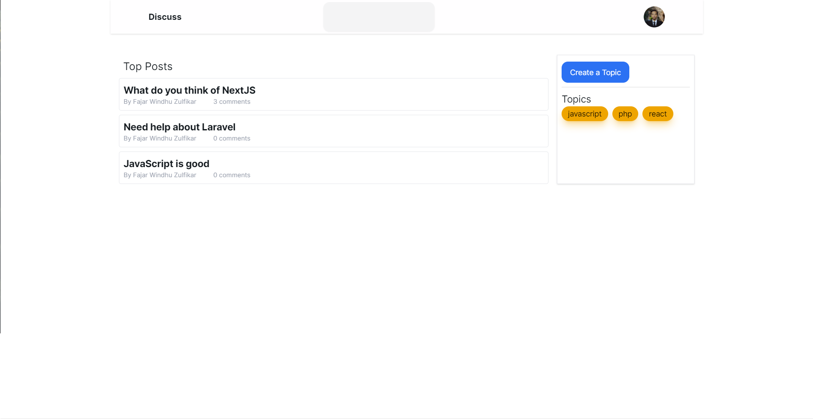
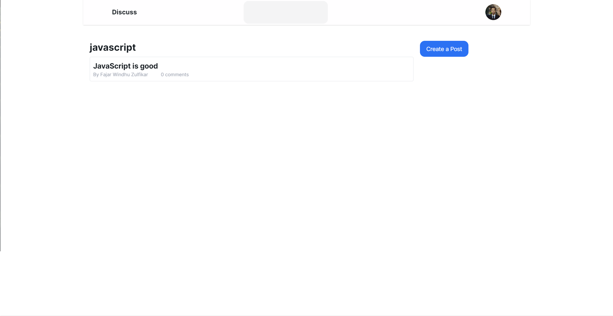
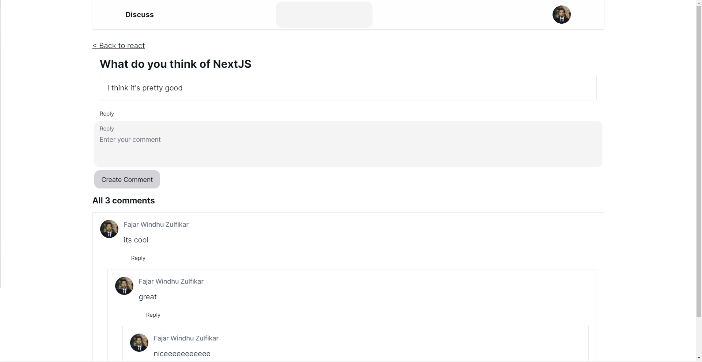
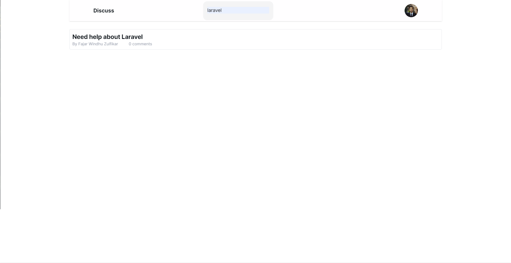

# Discuss

Discuss is a space to share your ideas, spark discussions, and connect with people who share the same passions as you. Built with Next.js.

## Features
- Login and sign up with Github
- Discussion list
- Topic list
- Create a topic
- Create discussions by Topic
- Reply to discussions
- Nested replies
- Search discussions

## Technologies
This project is built using the following technologies:

- Full-stack framework: Next.js
- Authentication: Next Auth
- Database: MySQL
- ORM: Prisma
- Form validation: Zod
- Animation: Framer Motion

## Installation

### Set Up .env

Create `.env` file from `.env.example` and adjust it with your development environment. You will need `GITHUB_CLIENT_ID` and `GITHUB_CLIENT_SECRET`.

After that, you can run the database migration by running the following command:

```bash
npx prisma db push
```

### Install Dependencies

```bash
npm install
```

### Run the Development Server

```bash
npm run dev
```

Open [http://localhost:3000](http://localhost:3000) with your browser to see the result.

## Screenshots

### Home Page


### Topic List Page


### Show Discussion Page


### Search Page
